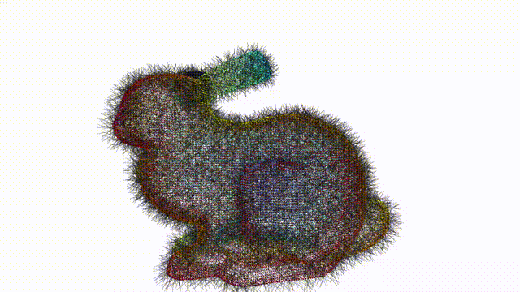

# Iterative Poisson Surface Reconstruction (iPSR)

## Introduction

An implementation of [iPSR (SIGGRAPH2022)](https://lcs.ios.ac.cn/~houf/pages/ipsr/index.html) based on [Open3D](http://www.open3d.org/).

Iterative Poisson Surface Reconstruction (iPSR) is a technique for reconstructing watertight surfaces from **unoriented** 3D point samples. Briefly speaking, iPSR randomly initializes normals. And then use screened PSR (a classic reconstruction method) to get a twisted and wrong surface. But from this reconstructed surface, iPSR is able to update the normal of point samples. Finally, iPSR can reconstruct surface with good quality in an iterative manner.

## Example



## Install

Prerequires:

- cmake = 3.22.0
- Open3D = 0.15.2
- Visual Studio 17 2022

```bash
git clone https://github.com/LinzhouLi/iPSR.git
cd iPSR
mkdir build
cd build
cmake -DOpen3D_ROOT=/path/to/open3d_install ..
cmake --build . --config Release
```

or use cmake GUI: 

`Configure` -> `Generate` -> open `.sln`  file

## Reference

Iterative Poisson Surface Reconstruction (iPSR) for Unoriented Points <br>
[Fei Hou](https://lcs.ios.ac.cn/~houf/), Chiyu Wang, [Wencheng Wang](https://lcs.ios.ac.cn/~whn/), [Hong Qin](https://www3.cs.stonybrook.edu/~qin/), Chen Qian, [Ying He](https://personal.ntu.edu.sg/yhe/) <br>
*ACM Transactions on Graphics, 41, 4, Article 128, 13 pages. (SIGGRAPH 2022)*
